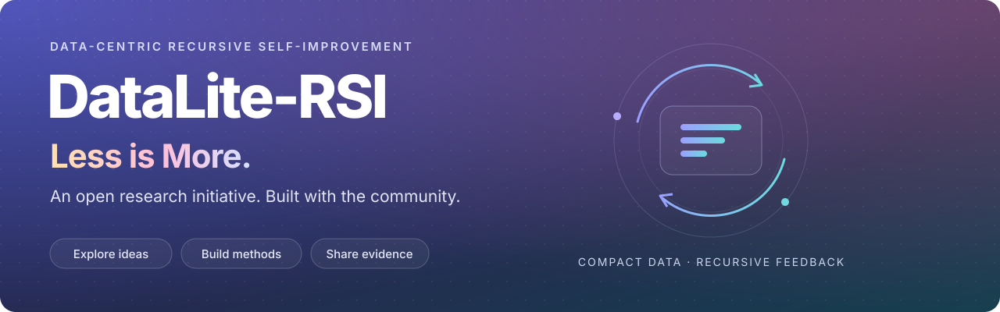

<div align="center">

<a href="https://haolpku.github.io/DataLite-RSI/">
  
</a>

<br>

[](https://haolpku.github.io/DataLite-RSI/) [](https://github.com/haolpku/DataLite-RSI/actions/workflows/validate-contributions.yml) [](#join-the-effort)

**An open research initiative for Less is More in RSI.**

How can we build more effective self-improving systems with less training data?<br>Join us to explore ideas, develop methods, and build the evidence together.

**[Homepage](https://haolpku.github.io/DataLite-RSI/)** &nbsp; · &nbsp; **[Results](#reported-results)** &nbsp; · &nbsp; **[Methods](#methods-and-available-materials)** &nbsp; · &nbsp; **[Reproduce](docs/reproduction.md)** &nbsp; · &nbsp; **[Join the effort](#join-the-effort)**

</div>

---

## The idea

**Less is More for Recursive Self-Improvement is our research direction.** We aim
to bring the community together around data-efficient RSI: better data decisions,
stronger feedback loops, and rigorous evidence about when a smaller training set
can be more useful.

The experiments in this repository are **initial explorations**. We welcome new
methods, tasks, modalities, and findings that challenge or extend these early
results. The project will grow with contributions from the community.

One starting point is to use feedback
from earlier attempts to improve what data is selected, how it is generated, and
how it is refined. The recursive state can be a selection rule, a synthesis policy,
a processing program, or the corpus itself.

| Select / synthesize / refine | Evaluate & reflect | Update the next decision |
| :---: | :---: | :---: |
| Construct a compact training set | Learn from quality, failures and model response | Evolve the rule, policy or program |

Training takes place within the loop or after search, depending on the method.
Read the [concept note](docs/concept.md) for the common framework and its limits.

> [!NOTE]
> **“Less” refers to the final training-data budget.** Candidate scoring, synthesis,
> training exposures, and evaluation can add substantial cost. The collection
> includes mixed results; it does not establish universal data or compute savings.

## Initial explorations

<table>
<tr>
<th width="33%" align="left">01 &nbsp; Selection</th>
<th width="34%" align="left">02 &nbsp; Synthesis</th>
<th width="33%" align="left">03 &nbsp; Transfer</th>
</tr>
<tr>
<td valign="top">
<strong>Choose useful examples</strong><br><br>
OPSD-Data-Lite selects progressively smaller subsets from a fixed candidate pool.
Its full-pool comparison uses the same reported optimizer-step budget; search adds compute.
<br><br><a href="rsi/methods/opsd-data-lite/">Explore OPSD →</a>
</td>
<td valign="top">
<strong>Improve how data is made</strong><br><br>
Policy-Evolving Edit Synthesis updates instruction policies from batch feedback,
compared with stratified synthesis at the same final pair budget.
<br><br><a href="rsi/methods/policy-evolving-edit-synthesis/">Explore synthesis →</a>
</td>
<td valign="top">
<strong>Test compact-data transfer</strong><br><br>
VideoRSI evaluates one compact SFT dataset across five model families, compared
with their respective base models.
<br><br><a href="rsi/methods/video-rsi/">Explore VideoRSI →</a>
</td>
</tr>
</table>

**Program and corpus refinement.** [DataFlow-Evolver](rsi/methods/dataflow-evolver/)
and [DataFlow-Self-Improver](rsi/methods/dataflow-self-improver/) extend these
perspectives. Evolver improves over base but falls below DataFlow's
expert-authored Math-3K reference; their eight-set and seven-set evaluation means
are not ranked together.

<a id="reported-results"></a>

## Experimental results

**[Explore interactive comparisons ↗](https://haolpku.github.io/DataLite-RSI/#rs-results)**

Explore our initial experiments in data-efficient RSI. Each result links to its
experiment record, with model settings and evaluation details. Math/video scores
are percentages; image scores are normalized composites. See the
[protocol guide](docs/protocol.md) for comparators and aggregation rules.

<details>
<summary><strong>View the complete result table</strong> — models, protocols and scores</summary>

<!-- results:start -->

| Method / model | Protocol / metric | Base → final |
| --- | --- | --- |
| [OPSD · Qwen3-8B](results/submissions/opsd-data-lite-qwen3-8b/result.json) | 5-set math (%) | 58.70 → 62.10 |
| [Evolver · Qwen2.5-7B](results/submissions/dataflow-evolver-qwen25-7b-math-3k/result.json) | 8-set math (%) | 30.67 → 37.93 |
| [Self-Improver · Qwen3-8B-Base](results/submissions/dataflow-self-improver-qwen3-8b-math-6k/result.json) | 7-set math (%) | 37.11 → 41.45 |
| [Policy synthesis · FLUX](results/submissions/policy-evolving-edit-synthesis-flux2-klein-9b/result.json) | Composite (0–1) | 0.79375 → 0.82400 |
| [Policy synthesis · Qwen Image](results/submissions/policy-evolving-edit-synthesis-qwen-image-edit-2511/result.json) | Composite (0–1) | 0.85010 → 0.86835 |
| [VideoRSI · Qwen3-VL-8B](results/submissions/video-rsi-qwen3-vl-8b-videomme-4p5k/result.json) | Video-MME (%) | 56.56 → 58.89 |
| [VideoRSI · LLaVA-OneVision-7B](results/submissions/video-rsi-llava-onevision-7b-videomme-4p5k/result.json) | Video-MME (%) | 58.52 → 59.48 |
| [VideoRSI · Qwen2.5-VL-3B](results/submissions/video-rsi-qwen25-vl-3b-videomme-4p5k/result.json) | Video-MME (%) | 42.44 → 59.04 |
| [VideoRSI · Gemma-4-E4B](results/submissions/video-rsi-gemma-4-e4b-videomme-4p5k/result.json) | Video-MME (%) | 47.74 → 48.37 |
| [VideoRSI · InternVL3-2B](results/submissions/video-rsi-internvl3-2b-videomme-4p5k/result.json) | Video-MME (%) | 34.85 → 55.22 |

<!-- results:end -->

</details>

Have a method, a new task, or a comparison to add?
[Contribute an experiment](results/README.md) and help extend the research.

## Methods and available materials

| Method | What evolves | Available now |
| --- | --- | --- |
| [OPSD-Data-Lite](rsi/methods/opsd-data-lite/) | Training subset | Description · config · math evaluation harness |
| [Policy-Evolving Edit Synthesis](rsi/methods/policy-evolving-edit-synthesis/) | Instruction-generation policies | Core loop · rubric tests · environment definition |
| [VideoRSI](rsi/methods/video-rsi/) | Video data pipeline | Description · config · Video-MME evaluation source |
| [DataFlow-Evolver](rsi/methods/dataflow-evolver/) | Data-processing program | Reference config · experiment report · grading harness |
| [DataFlow-Self-Improver](rsi/methods/dataflow-self-improver/) | Data pipeline and corpus | Description · config · iteration summaries |

Full reruns still require method-specific source, adapters or artifacts.
The [reproduction guide](docs/reproduction.md#follow-an-original-experiment)
lists what is available and what is missing for each method;
[open evidence gaps](docs/release-gaps.md) track the remaining work.

## Quick start

**Inspect and validate locally.** Python 3.11+; no GPU or model download needed.

```bash
git clone https://github.com/haolpku/DataLite-RSI.git
cd DataLite-RSI
python3 -m venv .venv
source .venv/bin/activate
python -m pip install -r requirements-dev.txt
python scripts/validate_contributions.py .
python scripts/run_checks.py
```

<details>
<summary><strong>Preview the project website locally</strong></summary>

```bash
python scripts/build_site.py --check
python -m http.server 8000 --directory _site
```

Open <http://localhost:8000>. The homepage source lives in [`site/`](site/), in
this repository. See the [maintenance guide](site/README.md) for editing and deployment.

</details>

For evaluator fixtures and original experiment requirements, continue with the
[reproduction guide](docs/reproduction.md). Some recorded training commands refer
to upstream implementations that are not yet public.

## Find your way around

| Explore the research | Run and reproduce | Extend the collection |
| --- | --- | --- |
| [Concept & scope](docs/concept.md) | [Reproduction guide](docs/reproduction.md) | [Contribution guide](CONTRIBUTING.md) |
| [Result records](results/) | [Evaluation harnesses](evaluation/) | [Manifest schemas](schemas/) |
| [Method packages](rsi/methods/) | [Docker environments](docker/) | [Copyable templates](templates/) |
| [Evaluation protocols](docs/protocol.md) | [Dataset registry](datasets/) | [中文贡献指南](docs/CONTRIBUTING_zh.md) |

<details>
<summary><strong>Repository map</strong></summary>

```text
DataLite-RSI/
├── site/         Project homepage source
├── docs/         Concept, protocols, reproduction and release notes
├── rsi/methods/  Method packages and configurations
├── results/      Experiment records and result summaries
├── benchmarks/  Suite definitions, evaluators and fixtures
├── datasets/    Dataset metadata and pinned references
├── evaluation/  Shared and vendored evaluation harnesses
├── docker/      Evaluation environment definitions
├── schemas/     Machine-readable contribution contracts
├── templates/   Starting points for new contributions
└── scripts/     Validation, offline checks and website generation
```

</details>

## Join the effort

We invite researchers, engineers, and practitioners to help shape **Less is More
for RSI**. You do not need a finished method or a positive result to participate.

| Bring your perspective | A useful starting point |
| --- | --- |
| **Ask a research question** | Where could better data decisions replace a larger training set? [Open an issue](https://github.com/haolpku/DataLite-RSI/issues). |
| **Explore a new method or task** | Study selection, synthesis, refinement, or another feedback mechanism in a new setting. |
| **Strengthen the evidence** | Reproduce a result, add matched-budget controls, measure total cost, or report a negative result. |
| **Make experiments easier to compare** | Contribute evaluators, datasets, reproducible configurations, or clearer protocols. |

Bring a **[benchmark](benchmarks/README.md)**, **[dataset](datasets/README.md)**,
**[result](results/README.md)**, or **[RSI method](rsi/README.md)**.
Reproductions, stronger controls, and well-documented negative results are useful
contributions. Start with [CONTRIBUTING.md](CONTRIBUTING.md).

<details>
<summary><strong>Maintaining results and storing artifacts</strong></summary>

Update scores in `results/submissions/*/result.json`, then run
`python scripts/build_site.py` to refresh the result table. The homepage reads
those same manifests; CI rejects a stale generated README table.

Keep code, manifests, docs and website source in GitHub. Store large datasets and
model artifacts externally; the current dataset hub is
[Lite-RSI on Hugging Face](https://huggingface.co/datasets/lhpku20010120/Lite-RSI).
Do not commit model weights, generated media, secrets, or dataset archives.

</details>

<details>
<summary><strong>Citation and licensing</strong></summary>

Paper and citation metadata are pending. Refer to this repository and a commit
when discussing the current collection. Method manifests currently declare
`NOASSERTION`; no project-wide reuse license has been assigned. Vendored components
retain their own license notices.

</details>

---

<div align="center">

**Let’s explore Less is More for RSI together.**<br>[Explore DataLite-RSI ↗](https://haolpku.github.io/DataLite-RSI/)

</div>
